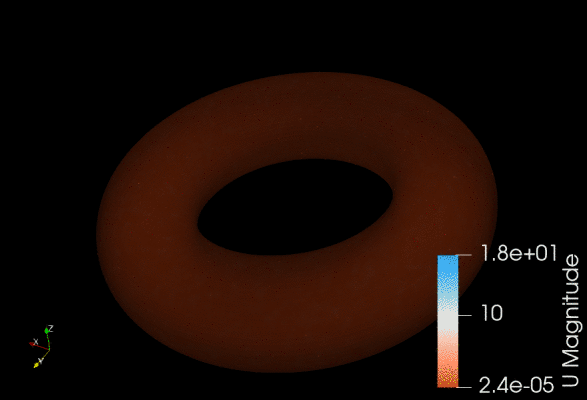

# Surfaise Examples
Examples for solving PDEs on parametrized surfaces with Surfaise.

To run an example script -- here a PFC-type Block Copolymer model on a bumpy surface -- simply execute
```
python3 pfcbc_bumpy.py
```
The included demos are:
* `pfcbc_bumpy.py`: Quenching of a PFC-type Block Copolymer model on a bumpy surface [[1]](#1)
* `ns_on_torus.py`: Fluid flow (Navier-Stokes) on a toroidal surface [[1]](#1)
* `pfcbc_gauss.py`: Annealing of a PFC-type Block Copolymer model on a single Gaussian bump.

<p align="center">
    
    <br /><b>Navier-Stokes flow on torus, w. forcing.</b>
</p>

### Developed and maintained by:
* Bjarke Frost Nielsen
* Gaute Linga


<a id="1">[1]</a> Nielsen, B. F., Linga, G., Christensen, A., & Mathiesen, J. (2019). Substrate curvature governs texture orientation in thin films of smectic block copolymers. arXiv preprint arXiv:1911.13163.
